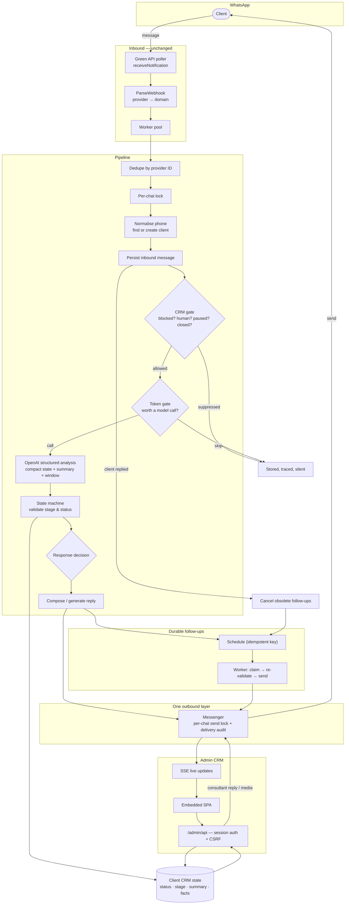

# Admin CRM and autonomous assistant

This document describes what was added on top of the existing WhatsApp lead bot,
and — just as importantly — what was deliberately left alone.

## What did not change

- **Inbound transport.** Messages still arrive through Green API native polling
  (`receiveNotification` / `deleteNotification`) in `internal/handler/greenapi_polling.go`.
  No incoming webhook was introduced, and the Meta webhook path still works when
  `WHATSAPP_PROVIDER=meta`.
- **The message pipeline's shape.** `store → gate → classify → decide → reply →
  qualify → notify` is intact. CRM behaviour was inserted as gates and state
  writes around it, not as a rewrite.
- **The existing database.** No table was dropped, renamed or truncated. The CRM
  reads and writes the same `users` and `messages` rows the bot already used.
- **The service catalog and trigger set.** The company's real services in
  `internal/service/catalog.go` are what the assistant sells; nothing was
  hardcoded alongside them.

## Architecture



### The two interlocks that matter

**Automation gate.** `crmGate` in `internal/service/pipeline_crm.go` runs after the
inbound message is stored and before a single token is spent. It suppresses
automation when the client is blocked, the conversation is in `human` or `paused`
mode, AI is disabled for that client, or the lead reached a terminal status. The
reason is written to `trace_events`, so silence is always explainable.

**Send serialisation.** Every outgoing message — AI reply, follow-up, lead alert
and consultant message — goes through `service.Messenger`, which holds a per-chat
lock. There is exactly one provider integration, and both producers use it.

## Conversation state machine

The model may *suggest* a qualification stage and a pipeline status. It can never
set one. `internal/service/statemachine.go` validates the value, then validates
the transition against what the database currently holds:

```
NEW → LANGUAGE_DETECTED → INTENT_DETECTED → QUALIFYING → QUALIFIED
    → WAITING_FOR_CLIENT → CONSULTANT_REQUIRED → HUMAN_TAKEOVER → CONVERTED/CLOSED
```

- escalation (`consultant_required`) and takeover are reachable from anywhere;
- stages never regress on the model's word;
- terminal statuses (`won`, `closed`, `lost`, `blocked`) and the
  consultant-owned statuses are **not** reachable by the model at all — those are
  human decisions;
- an unknown value is discarded rather than stored.

## Token strategy

Per message the model receives:

```
system/business instructions
+ compact client state (status, stage, service, language)
+ stored rolling summary
+ up to OPENAI_CONTEXT_MESSAGES recent turns
+ the current message
```

The rolling summary comes back as `summary_update` in the **same** structured
call the pipeline was already making, so keeping a durable summary costs **zero
extra API calls**. Facts that mention a deadline, document, company, consultation
or promise are marked critical and survive every compaction
(`mergeFacts` / `isCriticalFact`).

Cheap analysis and expensive generation are separately configurable:
`OPENAI_CLASSIFIER_MODEL` runs on every message, `OPENAI_MODEL` only when the
application has already decided to answer. Token usage is recorded per call in
`ai_interactions` and surfaced on the dashboard.

## Follow-ups

Jobs live in `follow_up_jobs`. Nothing is held in an in-memory timer, so a
restart loses nothing.

- **Idempotent scheduling** — `dedupe_key = u<client>:s<stage>:m<anchor message>`
  is `UNIQUE`. Re-running the same schedule is a no-op.
- **Exclusive claiming** — a conditional `UPDATE` stamps a random token; two
  workers running the identical statement claim disjoint sets.
- **Crash recovery** — a claim older than `FOLLOWUP_CLAIM_TTL_MINUTES` is
  reclaimable.
- **Re-validation before sending** — the claimed job is checked against the live
  client: still waiting, not blocked, not closed, AI still enabled, no consultant
  in charge, and the anchor is still the newest inbound message.
- **Cancellation** — the moment a client replies, every pending job for them is
  cancelled.
- **Business hours** — a nudge due outside the window is deferred to the next
  opening.

## Human takeover

`conversation_mode` is `ai`, `human` or `paused`.

- **Take over** is a compare-and-swap on the current mode, so two consultants
  clicking at the same moment cannot both believe they won.
- **Sending from the CRM takes over implicitly** — the moment a human speaks the
  assistant must stop, and nobody should have to remember to press a button
  first.
- Taking over cancels every pending follow-up and writes a visible system line
  into the conversation.
- **Resume AI** returns the conversation to automation; **Pause AI** stops it
  without assigning an owner.

## Security

| Concern | Measure |
| --- | --- |
| Password storage | PBKDF2-HMAC-SHA256, per-account 16-byte salt, 600k iterations (stdlib `crypto/pbkdf2`, no new dependency), constant-time compare |
| Sessions | 32-byte random token in an HttpOnly, SameSite=Lax cookie; only its SHA-256 digest is stored, so a database leak cannot be replayed |
| CSRF | Per-session token required on every unsafe method |
| Brute force | Per-caller and per-account limits, both in the database, so a restart does not reset an attacker's budget |
| Account enumeration | Identical error and equal work for a wrong password and an unknown email |
| SQL injection | Every query is parameterised; sort columns come from a whitelist |
| IDOR | A client ID from the browser is always resolved through the repository and checked |
| Uploads | MIME allow-list (no SVG, HTML or scripts), declared type must agree with sniffed content, size cap, server-generated random filenames, `0600` non-executable, path-traversal-proof resolution |
| Media serving | Authenticated, `nosniff`, sandbox CSP, forced `Content-Disposition` |
| XSS | The SPA builds DOM nodes and sets text, never `innerHTML` from data; strict CSP with no inline scripts |
| Prompt injection | Customer text is fenced as untrusted data in both prompts and never placed in the system prompt; the model cannot execute SQL, shell, file or admin actions, and every value it returns is re-validated |
| Secrets | Never in the API, the settings screen, the export or the logs; the browser never sees a provider credential |

## Data model additions

Added columns (all with defaults, all guarded by `PRAGMA table_info`):

- `users`: `crm_status`, `conversation_mode`, `ai_enabled`, `blocked`,
  `blocked_at`, `blocked_by`, `block_reason`, `assigned_admin_id`, `assigned_at`,
  `assigned_by`, `last_inbound_at`, `last_outbound_at`, `unread_count`,
  `ai_summary`, `important_facts`, `next_action`, `qualification_stage`,
  `ai_confidence`, `intent`, `follow_up_stage`, `next_follow_up_at`,
  `close_reason`, `tags`, `language_locked`, `summary_watermark`
- `messages`: `sender_type`, `sender_admin_id`, `media_path`, `media_mime`,
  `media_name`, `media_size`, `delivery_status`, `reply_to`, `metadata`

New tables: `admin_users`, `admin_sessions`, `follow_up_jobs`, `internal_notes`,
`audit_logs`, `crm_settings`, `login_attempts`.

Backfill (each statement a no-op on a second run): historical conversation states
map onto CRM statuses, inbound history is attributed to the client and outbound
to the assistant, and activity timestamps are derived once from the message
table.

## Running it

```sh
make build      # builds bin/lower and generates the systemd unit
make run        # installs, enables and starts the service
make restart    # rebuild + restart
make logs       # journalctl -u lower.service -f
```

The frontend needs no build step: it is a dependency-free ES-module SPA embedded
into the binary with `go:embed`. There is no Node toolchain on the server and no
bundle to rebuild — `make build` is still the whole deployment story.

Open `http://<host>:8080/admin/` and sign in with `ADMIN_EMAIL` /
`ADMIN_PASSWORD`. Put the CRM behind TLS and set `ADMIN_SECURE_COOKIES=true`.

### Tests

```sh
go test ./...          # full suite
go test -race ./...    # the concurrency guarantees above
```
